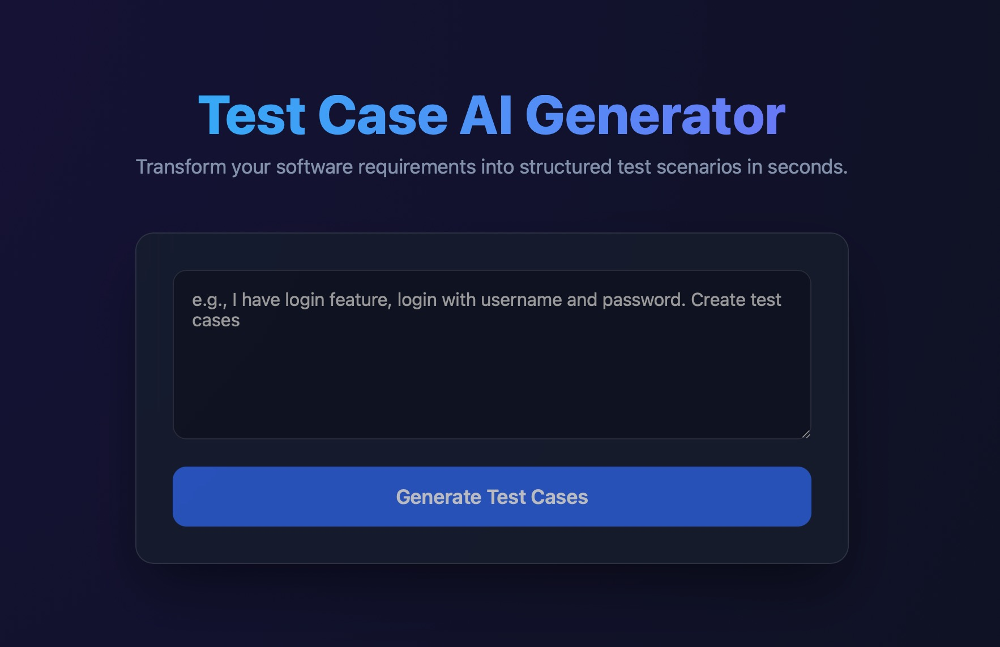

# Test Case AI Generator



This project is an AI-powered Test Case Generator that translates software requirements into structured test cases and edge cases. It consists of a Python backend utilizing FastAPI and a modern React frontend utilizing Vite.

## Project Structure

```text
Test-case-AI-Generator/
├── backend/              # Python FastAPI Application
│   ├── app/              # API, services, and core logic
│   ├── tests/            # Endpoint validation tests (pytest)
│   ├── pyproject.toml    # Python dependencies and metadata
│   └── Dockerfile        # Container setup for backend
├── frontend/             # React application (Vite)
│   ├── src/              # React components, styles, and API logic
│   ├── package.json      # NPM dependencies and scripts
│   └── vite.config.js    # Vite build configuration
└── agents.md             # Custom agent instructions
```

## Running the Backend

The backend provides the foundation for generating structured test cases using LLMs.

### 1. Setup Environment
Copy `.env.example` to `.env` (inside the `backend/` directory) and customize the configuration:
```bash
cd backend
cp .env.example .env
```

#### Configuration Options in `.env`:
- `AI_PROVIDER`: Choose `"ollama"` to run the model locally, or `"gemini"` to use the Gemini Cloud API.
- `GEMINI_API_KEY`: Required if `AI_PROVIDER="gemini"`.
- `OLLAMA_BASE_URL`: Base URL of your local Ollama instance (defaults to `http://localhost:11434`).
- `MODEL_NAME`: The target model name (e.g., `qwen3:4b` for Ollama, or `gemini-2.0-flash` for Gemini).

### 2. Install Dependencies
Ensure you have a Python environment setup (Python 3.13+ recommended):
```bash
cd backend
python3 -m venv .venv
source .venv/bin/activate
pip install -e ".[dev]"
pip install pytest pytest-asyncio ruff
```

### 3. Start Backend Server
Ensure your local Ollama server is running if using Ollama. Start the FastAPI server from the `backend` directory:
```bash
# Activate the virtual environment
source .venv/bin/activate

# Start the uvicorn server
uvicorn app.main:app --reload
```
Navigate to **[http://localhost:8000/docs](http://localhost:8000/docs)** to view the interactive Swagger OpenAPI documentation.

### 4. Running Backend Tests & Linting
From the `backend` directory:
```bash
# Run unit tests
.venv/bin/pytest

# Run code formatting and lint verification
.venv/bin/ruff format .
.venv/bin/ruff check .
```

## Running the Frontend

The frontend provides a modern, fast, and responsive user interface to interact with the Test Case Generator.

### 1. Install Dependencies
Make sure you have Node.js installed, then install the required packages:
```bash
cd frontend
npm install
```

### 2. Start Frontend Server
Start the Vite development server:
```bash
npm run dev
```
The server will typically start on **[http://localhost:5173](http://localhost:5173)**. Open this URL in your browser to interact with the application.

## Testing the Application Health

To verify that your backend API is up and running properly, you can test the health endpoint.

With the backend server running, open a new terminal and run:
```bash
curl http://localhost:8000/health
```
**Expected Output:**
```json
{"status":"ok","timestamp":"2026-07-20T...","provider":"ollama"}
```

You can also test it directly in your browser by visiting **[http://localhost:8000/health](http://localhost:8000/health)**.

## Docker Container (Backend)

Build and run in a production-ready containerized environment:
```bash
cd backend
docker build -t test-case-generator-backend .
docker run -p 8000:8000 --env-file .env test-case-generator-backend
```

## Features

### Save to Markdown
You can save your generated test cases directly to a Markdown (`.md`) file on your local filesystem.
- In the frontend UI, after generating test cases, scroll down to the "Save as Markdown" section.
- Enter a desired filename (e.g., `login_tests`) and click **Save File**.
- The file will be saved in the `test-cases/` directory at the root level of this project.
